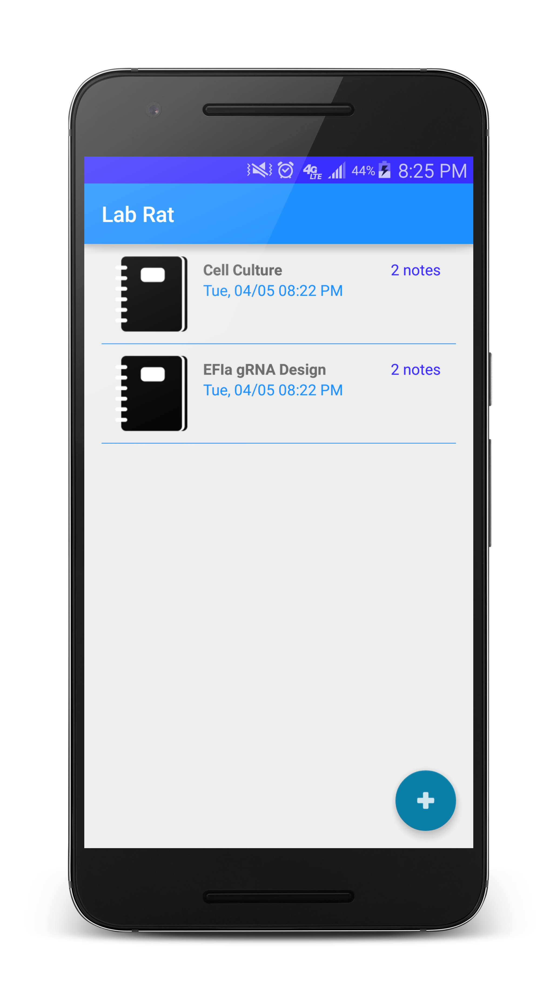

# LaboratoryNoteHelper aka Lab Rat (working title)
An app for storing laboratory notes in Android.

TODO:
  - Make the notes searchable from the Action bar.
  - Different types of notes (plate info, freezer boxes etc).
  - Bulk export results (google drive, evernote with API; may be more complex with images attached, I could possibly send a long list of text however. For Evernote: https://dev.evernote.com/doc/articles/android_intents.php).
  - Update the UI, its getting a bit crowded. I need to play around and see what works. 

BUGS: 
  - Note don't sinc up properly to their respective Notebooks. I need to pass additional extras.
  - Note count at main page counts global notes rather than the number of notes in a specific Notebook.
